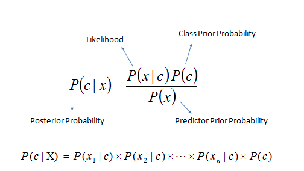

# Maximum A Posterior Estimation
This repo is an ez implementaion of MAP
## Introduction
#### In Bayesian statistics, a maximum a posterior probability (MAP) is an estimation of an unknown features by calculating the posterior
The posterior is calculate by

The posterior is proportional to $P(X | C) * P(C)$

## Dataset
I use the dataset with a [chemical analysis of wines](https://archive.ics.uci.edu/ml/datasets/Wine) derived from three different cultivars. The analysis determined the quantities of 13 constituents found in each of the three types of wines.
## Implementaion Detail
The implementaion detail is shown in the [Report folder](https://github.com/ss80226/MAP_estimation/tree/master/report)

