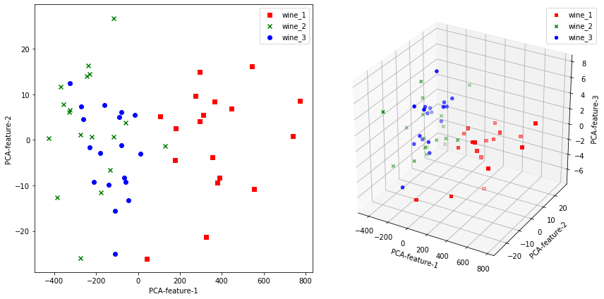

## Part 1. Split the training and testing data


```python
import numpy as np
import pandas as pd
import scipy
```


```python
df=pd.read_csv('Wine.csv', sep=',',header=None)
```


```python
df
```


<div>
<style scoped>
    .dataframe tbody tr th:only-of-type {
        vertical-align: middle;
    }

    .dataframe tbody tr th {
        vertical-align: top;
    }

    .dataframe thead th {
        text-align: right;
    }
</style>
<table border="1" class="dataframe">
  <thead>
    <tr style="text-align: right;">
      <th></th>
      <th>0</th>
      <th>1</th>
      <th>2</th>
      <th>3</th>
      <th>4</th>
      <th>5</th>
      <th>6</th>
      <th>7</th>
      <th>8</th>
      <th>9</th>
      <th>10</th>
      <th>11</th>
      <th>12</th>
      <th>13</th>
    </tr>
  </thead>
  <tbody>
    <tr>
      <th>0</th>
      <td>1</td>
      <td>14.23</td>
      <td>1.71</td>
      <td>2.43</td>
      <td>15.6</td>
      <td>127</td>
      <td>2.80</td>
      <td>3.06</td>
      <td>0.28</td>
      <td>2.29</td>
      <td>5.64</td>
      <td>1.04</td>
      <td>3.92</td>
      <td>1065</td>
    </tr>
    <tr>
      <th>1</th>
      <td>1</td>
      <td>13.20</td>
      <td>1.78</td>
      <td>2.14</td>
      <td>11.2</td>
      <td>100</td>
      <td>2.65</td>
      <td>2.76</td>
      <td>0.26</td>
      <td>1.28</td>
      <td>4.38</td>
      <td>1.05</td>
      <td>3.40</td>
      <td>1050</td>
    </tr>
    <tr>
      <th>2</th>
      <td>1</td>
      <td>13.16</td>
      <td>2.36</td>
      <td>2.67</td>
      <td>18.6</td>
      <td>101</td>
      <td>2.80</td>
      <td>3.24</td>
      <td>0.30</td>
      <td>2.81</td>
      <td>5.68</td>
      <td>1.03</td>
      <td>3.17</td>
      <td>1185</td>
    </tr>
    <tr>
      <th>3</th>
      <td>1</td>
      <td>14.37</td>
      <td>1.95</td>
      <td>2.50</td>
      <td>16.8</td>
      <td>113</td>
      <td>3.85</td>
      <td>3.49</td>
      <td>0.24</td>
      <td>2.18</td>
      <td>7.80</td>
      <td>0.86</td>
      <td>3.45</td>
      <td>1480</td>
    </tr>
    <tr>
      <th>4</th>
      <td>1</td>
      <td>13.24</td>
      <td>2.59</td>
      <td>2.87</td>
      <td>21.0</td>
      <td>118</td>
      <td>2.80</td>
      <td>2.69</td>
      <td>0.39</td>
      <td>1.82</td>
      <td>4.32</td>
      <td>1.04</td>
      <td>2.93</td>
      <td>735</td>
    </tr>
    <tr>
      <th>...</th>
      <td>...</td>
      <td>...</td>
      <td>...</td>
      <td>...</td>
      <td>...</td>
      <td>...</td>
      <td>...</td>
      <td>...</td>
      <td>...</td>
      <td>...</td>
      <td>...</td>
      <td>...</td>
      <td>...</td>
      <td>...</td>
    </tr>
    <tr>
      <th>173</th>
      <td>3</td>
      <td>13.71</td>
      <td>5.65</td>
      <td>2.45</td>
      <td>20.5</td>
      <td>95</td>
      <td>1.68</td>
      <td>0.61</td>
      <td>0.52</td>
      <td>1.06</td>
      <td>7.70</td>
      <td>0.64</td>
      <td>1.74</td>
      <td>740</td>
    </tr>
    <tr>
      <th>174</th>
      <td>3</td>
      <td>13.40</td>
      <td>3.91</td>
      <td>2.48</td>
      <td>23.0</td>
      <td>102</td>
      <td>1.80</td>
      <td>0.75</td>
      <td>0.43</td>
      <td>1.41</td>
      <td>7.30</td>
      <td>0.70</td>
      <td>1.56</td>
      <td>750</td>
    </tr>
    <tr>
      <th>175</th>
      <td>3</td>
      <td>13.27</td>
      <td>4.28</td>
      <td>2.26</td>
      <td>20.0</td>
      <td>120</td>
      <td>1.59</td>
      <td>0.69</td>
      <td>0.43</td>
      <td>1.35</td>
      <td>10.20</td>
      <td>0.59</td>
      <td>1.56</td>
      <td>835</td>
    </tr>
    <tr>
      <th>176</th>
      <td>3</td>
      <td>13.17</td>
      <td>2.59</td>
      <td>2.37</td>
      <td>20.0</td>
      <td>120</td>
      <td>1.65</td>
      <td>0.68</td>
      <td>0.53</td>
      <td>1.46</td>
      <td>9.30</td>
      <td>0.60</td>
      <td>1.62</td>
      <td>840</td>
    </tr>
    <tr>
      <th>177</th>
      <td>3</td>
      <td>14.13</td>
      <td>4.10</td>
      <td>2.74</td>
      <td>24.5</td>
      <td>96</td>
      <td>2.05</td>
      <td>0.76</td>
      <td>0.56</td>
      <td>1.35</td>
      <td>9.20</td>
      <td>0.61</td>
      <td>1.60</td>
      <td>560</td>
    </tr>
  </tbody>
</table>
<p>178 rows × 14 columns</p>
</div>


```python
df_array = df.values
```


```python
df_array.shape
```


    (178, 14)


### 1. Counting Label


```python
label_count = [0, 0, 0]
for i in range(df_array.shape[0]):
    label_count[int(df_array[i][0]-1)] += 1
```


```python
# show the number of each class
label_count
```


    [59, 71, 48]


### 2. Shuffle the dataset to split into testing and training data


```python
np.random.shuffle(df_array[0:label_count[0]])
np.random.shuffle(df_array[label_count[0]:label_count[0]+label_count[1]])
np.random.shuffle(df_array[label_count[0]+label_count[1]:df_array.shape[0]])
```


```python
testing_list = []
training_list = []
testing_list.append(df_array[0:18])
training_list.append(df_array[18:label_count[0]])
testing_list.append(df_array[label_count[0]:label_count[0]+18])
training_list.append(df_array[label_count[0]+18:label_count[0]+label_count[1]])
testing_list.append(df_array[label_count[0]+label_count[1]:label_count[0]+label_count[1]+18])
training_list.append(df_array[label_count[0]+label_count[1]+18:df_array.shape[0]])

testing_array = np.array(testing_list)
training_array = np.array(training_list)
testing_array = np.reshape(testing_array, (-1, 14))
tmp = np.concatenate((training_array[0], training_array[1]))
training_array = np.concatenate((tmp, training_array[2]))
```

### 3. Create pandas dataframe


```python
testing_df = pd.DataFrame(testing_array)
testing_df[0] = testing_df[0].apply(int)
training_df = pd.DataFrame(training_array)
training_df[0] = training_df[0].apply(int)
```


```python
testing_df
```


<div>
<style scoped>
    .dataframe tbody tr th:only-of-type {
        vertical-align: middle;
    }

    .dataframe tbody tr th {
        vertical-align: top;
    }

    .dataframe thead th {
        text-align: right;
    }
</style>
<table border="1" class="dataframe">
  <thead>
    <tr style="text-align: right;">
      <th></th>
      <th>0</th>
      <th>1</th>
      <th>2</th>
      <th>3</th>
      <th>4</th>
      <th>5</th>
      <th>6</th>
      <th>7</th>
      <th>8</th>
      <th>9</th>
      <th>10</th>
      <th>11</th>
      <th>12</th>
      <th>13</th>
    </tr>
  </thead>
  <tbody>
    <tr>
      <th>0</th>
      <td>1</td>
      <td>13.51</td>
      <td>1.80</td>
      <td>2.65</td>
      <td>19.0</td>
      <td>110.0</td>
      <td>2.35</td>
      <td>2.53</td>
      <td>0.29</td>
      <td>1.54</td>
      <td>4.200000</td>
      <td>1.100</td>
      <td>2.87</td>
      <td>1095.0</td>
    </tr>
    <tr>
      <th>1</th>
      <td>1</td>
      <td>13.71</td>
      <td>1.86</td>
      <td>2.36</td>
      <td>16.6</td>
      <td>101.0</td>
      <td>2.61</td>
      <td>2.88</td>
      <td>0.27</td>
      <td>1.69</td>
      <td>3.800000</td>
      <td>1.110</td>
      <td>4.00</td>
      <td>1035.0</td>
    </tr>
    <tr>
      <th>2</th>
      <td>1</td>
      <td>13.56</td>
      <td>1.73</td>
      <td>2.46</td>
      <td>20.5</td>
      <td>116.0</td>
      <td>2.96</td>
      <td>2.78</td>
      <td>0.20</td>
      <td>2.45</td>
      <td>6.250000</td>
      <td>0.980</td>
      <td>3.03</td>
      <td>1120.0</td>
    </tr>
    <tr>
      <th>3</th>
      <td>1</td>
      <td>13.58</td>
      <td>1.66</td>
      <td>2.36</td>
      <td>19.1</td>
      <td>106.0</td>
      <td>2.86</td>
      <td>3.19</td>
      <td>0.22</td>
      <td>1.95</td>
      <td>6.900000</td>
      <td>1.090</td>
      <td>2.88</td>
      <td>1515.0</td>
    </tr>
    <tr>
      <th>4</th>
      <td>1</td>
      <td>13.48</td>
      <td>1.81</td>
      <td>2.41</td>
      <td>20.5</td>
      <td>100.0</td>
      <td>2.70</td>
      <td>2.98</td>
      <td>0.26</td>
      <td>1.86</td>
      <td>5.100000</td>
      <td>1.040</td>
      <td>3.47</td>
      <td>920.0</td>
    </tr>
    <tr>
      <th>5</th>
      <td>1</td>
      <td>13.87</td>
      <td>1.90</td>
      <td>2.80</td>
      <td>19.4</td>
      <td>107.0</td>
      <td>2.95</td>
      <td>2.97</td>
      <td>0.37</td>
      <td>1.76</td>
      <td>4.500000</td>
      <td>1.250</td>
      <td>3.40</td>
      <td>915.0</td>
    </tr>
    <tr>
      <th>6</th>
      <td>1</td>
      <td>14.37</td>
      <td>1.95</td>
      <td>2.50</td>
      <td>16.8</td>
      <td>113.0</td>
      <td>3.85</td>
      <td>3.49</td>
      <td>0.24</td>
      <td>2.18</td>
      <td>7.800000</td>
      <td>0.860</td>
      <td>3.45</td>
      <td>1480.0</td>
    </tr>
    <tr>
      <th>7</th>
      <td>1</td>
      <td>13.05</td>
      <td>1.65</td>
      <td>2.55</td>
      <td>18.0</td>
      <td>98.0</td>
      <td>2.45</td>
      <td>2.43</td>
      <td>0.29</td>
      <td>1.44</td>
      <td>4.250000</td>
      <td>1.120</td>
      <td>2.51</td>
      <td>1105.0</td>
    </tr>
    <tr>
      <th>8</th>
      <td>1</td>
      <td>13.16</td>
      <td>2.36</td>
      <td>2.67</td>
      <td>18.6</td>
      <td>101.0</td>
      <td>2.80</td>
      <td>3.24</td>
      <td>0.30</td>
      <td>2.81</td>
      <td>5.680000</td>
      <td>1.030</td>
      <td>3.17</td>
      <td>1185.0</td>
    </tr>
    <tr>
      <th>9</th>
      <td>1</td>
      <td>13.50</td>
      <td>1.81</td>
      <td>2.61</td>
      <td>20.0</td>
      <td>96.0</td>
      <td>2.53</td>
      <td>2.61</td>
      <td>0.28</td>
      <td>1.66</td>
      <td>3.520000</td>
      <td>1.120</td>
      <td>3.82</td>
      <td>845.0</td>
    </tr>
    <tr>
      <th>10</th>
      <td>1</td>
      <td>14.06</td>
      <td>1.63</td>
      <td>2.28</td>
      <td>16.0</td>
      <td>126.0</td>
      <td>3.00</td>
      <td>3.17</td>
      <td>0.24</td>
      <td>2.10</td>
      <td>5.650000</td>
      <td>1.090</td>
      <td>3.71</td>
      <td>780.0</td>
    </tr>
    <tr>
      <th>11</th>
      <td>1</td>
      <td>12.85</td>
      <td>1.60</td>
      <td>2.52</td>
      <td>17.8</td>
      <td>95.0</td>
      <td>2.48</td>
      <td>2.37</td>
      <td>0.26</td>
      <td>1.46</td>
      <td>3.930000</td>
      <td>1.090</td>
      <td>3.63</td>
      <td>1015.0</td>
    </tr>
    <tr>
      <th>12</th>
      <td>1</td>
      <td>13.83</td>
      <td>1.57</td>
      <td>2.62</td>
      <td>20.0</td>
      <td>115.0</td>
      <td>2.95</td>
      <td>3.40</td>
      <td>0.40</td>
      <td>1.72</td>
      <td>6.600000</td>
      <td>1.130</td>
      <td>2.57</td>
      <td>1130.0</td>
    </tr>
    <tr>
      <th>13</th>
      <td>1</td>
      <td>13.30</td>
      <td>1.72</td>
      <td>2.14</td>
      <td>17.0</td>
      <td>94.0</td>
      <td>2.40</td>
      <td>2.19</td>
      <td>0.27</td>
      <td>1.35</td>
      <td>3.950000</td>
      <td>1.020</td>
      <td>2.77</td>
      <td>1285.0</td>
    </tr>
    <tr>
      <th>14</th>
      <td>1</td>
      <td>14.23</td>
      <td>1.71</td>
      <td>2.43</td>
      <td>15.6</td>
      <td>127.0</td>
      <td>2.80</td>
      <td>3.06</td>
      <td>0.28</td>
      <td>2.29</td>
      <td>5.640000</td>
      <td>1.040</td>
      <td>3.92</td>
      <td>1065.0</td>
    </tr>
    <tr>
      <th>15</th>
      <td>1</td>
      <td>13.41</td>
      <td>3.84</td>
      <td>2.12</td>
      <td>18.8</td>
      <td>90.0</td>
      <td>2.45</td>
      <td>2.68</td>
      <td>0.27</td>
      <td>1.48</td>
      <td>4.280000</td>
      <td>0.910</td>
      <td>3.00</td>
      <td>1035.0</td>
    </tr>
    <tr>
      <th>16</th>
      <td>1</td>
      <td>13.20</td>
      <td>1.78</td>
      <td>2.14</td>
      <td>11.2</td>
      <td>100.0</td>
      <td>2.65</td>
      <td>2.76</td>
      <td>0.26</td>
      <td>1.28</td>
      <td>4.380000</td>
      <td>1.050</td>
      <td>3.40</td>
      <td>1050.0</td>
    </tr>
    <tr>
      <th>17</th>
      <td>1</td>
      <td>14.06</td>
      <td>2.15</td>
      <td>2.61</td>
      <td>17.6</td>
      <td>121.0</td>
      <td>2.60</td>
      <td>2.51</td>
      <td>0.31</td>
      <td>1.25</td>
      <td>5.050000</td>
      <td>1.060</td>
      <td>3.58</td>
      <td>1295.0</td>
    </tr>
    <tr>
      <th>18</th>
      <td>2</td>
      <td>12.69</td>
      <td>1.53</td>
      <td>2.26</td>
      <td>20.7</td>
      <td>80.0</td>
      <td>1.38</td>
      <td>1.46</td>
      <td>0.58</td>
      <td>1.62</td>
      <td>3.050000</td>
      <td>0.960</td>
      <td>2.06</td>
      <td>495.0</td>
    </tr>
    <tr>
      <th>19</th>
      <td>2</td>
      <td>12.77</td>
      <td>3.43</td>
      <td>1.98</td>
      <td>16.0</td>
      <td>80.0</td>
      <td>1.63</td>
      <td>1.25</td>
      <td>0.43</td>
      <td>0.83</td>
      <td>3.400000</td>
      <td>0.700</td>
      <td>2.12</td>
      <td>372.0</td>
    </tr>
    <tr>
      <th>20</th>
      <td>2</td>
      <td>11.82</td>
      <td>1.72</td>
      <td>1.88</td>
      <td>19.5</td>
      <td>86.0</td>
      <td>2.50</td>
      <td>1.64</td>
      <td>0.37</td>
      <td>1.42</td>
      <td>2.060000</td>
      <td>0.940</td>
      <td>2.44</td>
      <td>415.0</td>
    </tr>
    <tr>
      <th>21</th>
      <td>2</td>
      <td>11.56</td>
      <td>2.05</td>
      <td>3.23</td>
      <td>28.5</td>
      <td>119.0</td>
      <td>3.18</td>
      <td>5.08</td>
      <td>0.47</td>
      <td>1.87</td>
      <td>6.000000</td>
      <td>0.930</td>
      <td>3.69</td>
      <td>465.0</td>
    </tr>
    <tr>
      <th>22</th>
      <td>2</td>
      <td>13.11</td>
      <td>1.01</td>
      <td>1.70</td>
      <td>15.0</td>
      <td>78.0</td>
      <td>2.98</td>
      <td>3.18</td>
      <td>0.26</td>
      <td>2.28</td>
      <td>5.300000</td>
      <td>1.120</td>
      <td>3.18</td>
      <td>502.0</td>
    </tr>
    <tr>
      <th>23</th>
      <td>2</td>
      <td>11.76</td>
      <td>2.68</td>
      <td>2.92</td>
      <td>20.0</td>
      <td>103.0</td>
      <td>1.75</td>
      <td>2.03</td>
      <td>0.60</td>
      <td>1.05</td>
      <td>3.800000</td>
      <td>1.230</td>
      <td>2.50</td>
      <td>607.0</td>
    </tr>
    <tr>
      <th>24</th>
      <td>2</td>
      <td>11.45</td>
      <td>2.40</td>
      <td>2.42</td>
      <td>20.0</td>
      <td>96.0</td>
      <td>2.90</td>
      <td>2.79</td>
      <td>0.32</td>
      <td>1.83</td>
      <td>3.250000</td>
      <td>0.800</td>
      <td>3.39</td>
      <td>625.0</td>
    </tr>
    <tr>
      <th>25</th>
      <td>2</td>
      <td>12.29</td>
      <td>1.61</td>
      <td>2.21</td>
      <td>20.4</td>
      <td>103.0</td>
      <td>1.10</td>
      <td>1.02</td>
      <td>0.37</td>
      <td>1.46</td>
      <td>3.050000</td>
      <td>0.906</td>
      <td>1.82</td>
      <td>870.0</td>
    </tr>
    <tr>
      <th>26</th>
      <td>2</td>
      <td>11.61</td>
      <td>1.35</td>
      <td>2.70</td>
      <td>20.0</td>
      <td>94.0</td>
      <td>2.74</td>
      <td>2.92</td>
      <td>0.29</td>
      <td>2.49</td>
      <td>2.650000</td>
      <td>0.960</td>
      <td>3.26</td>
      <td>680.0</td>
    </tr>
    <tr>
      <th>27</th>
      <td>2</td>
      <td>12.42</td>
      <td>2.55</td>
      <td>2.27</td>
      <td>22.0</td>
      <td>90.0</td>
      <td>1.68</td>
      <td>1.84</td>
      <td>0.66</td>
      <td>1.42</td>
      <td>2.700000</td>
      <td>0.860</td>
      <td>3.30</td>
      <td>315.0</td>
    </tr>
    <tr>
      <th>28</th>
      <td>2</td>
      <td>12.08</td>
      <td>1.39</td>
      <td>2.50</td>
      <td>22.5</td>
      <td>84.0</td>
      <td>2.56</td>
      <td>2.29</td>
      <td>0.43</td>
      <td>1.04</td>
      <td>2.900000</td>
      <td>0.930</td>
      <td>3.19</td>
      <td>385.0</td>
    </tr>
    <tr>
      <th>29</th>
      <td>2</td>
      <td>11.46</td>
      <td>3.74</td>
      <td>1.82</td>
      <td>19.5</td>
      <td>107.0</td>
      <td>3.18</td>
      <td>2.58</td>
      <td>0.24</td>
      <td>3.58</td>
      <td>2.900000</td>
      <td>0.750</td>
      <td>2.81</td>
      <td>562.0</td>
    </tr>
    <tr>
      <th>30</th>
      <td>2</td>
      <td>11.79</td>
      <td>2.13</td>
      <td>2.78</td>
      <td>28.5</td>
      <td>92.0</td>
      <td>2.13</td>
      <td>2.24</td>
      <td>0.58</td>
      <td>1.76</td>
      <td>3.000000</td>
      <td>0.970</td>
      <td>2.44</td>
      <td>466.0</td>
    </tr>
    <tr>
      <th>31</th>
      <td>2</td>
      <td>11.84</td>
      <td>0.89</td>
      <td>2.58</td>
      <td>18.0</td>
      <td>94.0</td>
      <td>2.20</td>
      <td>2.21</td>
      <td>0.22</td>
      <td>2.35</td>
      <td>3.050000</td>
      <td>0.790</td>
      <td>3.08</td>
      <td>520.0</td>
    </tr>
    <tr>
      <th>32</th>
      <td>2</td>
      <td>13.86</td>
      <td>1.51</td>
      <td>2.67</td>
      <td>25.0</td>
      <td>86.0</td>
      <td>2.95</td>
      <td>2.86</td>
      <td>0.21</td>
      <td>1.87</td>
      <td>3.380000</td>
      <td>1.360</td>
      <td>3.16</td>
      <td>410.0</td>
    </tr>
    <tr>
      <th>33</th>
      <td>2</td>
      <td>12.08</td>
      <td>1.33</td>
      <td>2.30</td>
      <td>23.6</td>
      <td>70.0</td>
      <td>2.20</td>
      <td>1.59</td>
      <td>0.42</td>
      <td>1.38</td>
      <td>1.740000</td>
      <td>1.070</td>
      <td>3.21</td>
      <td>625.0</td>
    </tr>
    <tr>
      <th>34</th>
      <td>2</td>
      <td>12.17</td>
      <td>1.45</td>
      <td>2.53</td>
      <td>19.0</td>
      <td>104.0</td>
      <td>1.89</td>
      <td>1.75</td>
      <td>0.45</td>
      <td>1.03</td>
      <td>2.950000</td>
      <td>1.450</td>
      <td>2.23</td>
      <td>355.0</td>
    </tr>
    <tr>
      <th>35</th>
      <td>2</td>
      <td>12.25</td>
      <td>1.73</td>
      <td>2.12</td>
      <td>19.0</td>
      <td>80.0</td>
      <td>1.65</td>
      <td>2.03</td>
      <td>0.37</td>
      <td>1.63</td>
      <td>3.400000</td>
      <td>1.000</td>
      <td>3.17</td>
      <td>510.0</td>
    </tr>
    <tr>
      <th>36</th>
      <td>3</td>
      <td>12.88</td>
      <td>2.99</td>
      <td>2.40</td>
      <td>20.0</td>
      <td>104.0</td>
      <td>1.30</td>
      <td>1.22</td>
      <td>0.24</td>
      <td>0.83</td>
      <td>5.400000</td>
      <td>0.740</td>
      <td>1.42</td>
      <td>530.0</td>
    </tr>
    <tr>
      <th>37</th>
      <td>3</td>
      <td>14.16</td>
      <td>2.51</td>
      <td>2.48</td>
      <td>20.0</td>
      <td>91.0</td>
      <td>1.68</td>
      <td>0.70</td>
      <td>0.44</td>
      <td>1.24</td>
      <td>9.700000</td>
      <td>0.620</td>
      <td>1.71</td>
      <td>660.0</td>
    </tr>
    <tr>
      <th>38</th>
      <td>3</td>
      <td>13.84</td>
      <td>4.12</td>
      <td>2.38</td>
      <td>19.5</td>
      <td>89.0</td>
      <td>1.80</td>
      <td>0.83</td>
      <td>0.48</td>
      <td>1.56</td>
      <td>9.010000</td>
      <td>0.570</td>
      <td>1.64</td>
      <td>480.0</td>
    </tr>
    <tr>
      <th>39</th>
      <td>3</td>
      <td>13.17</td>
      <td>5.19</td>
      <td>2.32</td>
      <td>22.0</td>
      <td>93.0</td>
      <td>1.74</td>
      <td>0.63</td>
      <td>0.61</td>
      <td>1.55</td>
      <td>7.900000</td>
      <td>0.600</td>
      <td>1.48</td>
      <td>725.0</td>
    </tr>
    <tr>
      <th>40</th>
      <td>3</td>
      <td>13.45</td>
      <td>3.70</td>
      <td>2.60</td>
      <td>23.0</td>
      <td>111.0</td>
      <td>1.70</td>
      <td>0.92</td>
      <td>0.43</td>
      <td>1.46</td>
      <td>10.680000</td>
      <td>0.850</td>
      <td>1.56</td>
      <td>695.0</td>
    </tr>
    <tr>
      <th>41</th>
      <td>3</td>
      <td>12.96</td>
      <td>3.45</td>
      <td>2.35</td>
      <td>18.5</td>
      <td>106.0</td>
      <td>1.39</td>
      <td>0.70</td>
      <td>0.40</td>
      <td>0.94</td>
      <td>5.280000</td>
      <td>0.680</td>
      <td>1.75</td>
      <td>675.0</td>
    </tr>
    <tr>
      <th>42</th>
      <td>3</td>
      <td>13.88</td>
      <td>5.04</td>
      <td>2.23</td>
      <td>20.0</td>
      <td>80.0</td>
      <td>0.98</td>
      <td>0.34</td>
      <td>0.40</td>
      <td>0.68</td>
      <td>4.900000</td>
      <td>0.580</td>
      <td>1.33</td>
      <td>415.0</td>
    </tr>
    <tr>
      <th>43</th>
      <td>3</td>
      <td>13.69</td>
      <td>3.26</td>
      <td>2.54</td>
      <td>20.0</td>
      <td>107.0</td>
      <td>1.83</td>
      <td>0.56</td>
      <td>0.50</td>
      <td>0.80</td>
      <td>5.880000</td>
      <td>0.960</td>
      <td>1.82</td>
      <td>680.0</td>
    </tr>
    <tr>
      <th>44</th>
      <td>3</td>
      <td>13.32</td>
      <td>3.24</td>
      <td>2.38</td>
      <td>21.5</td>
      <td>92.0</td>
      <td>1.93</td>
      <td>0.76</td>
      <td>0.45</td>
      <td>1.25</td>
      <td>8.420000</td>
      <td>0.550</td>
      <td>1.62</td>
      <td>650.0</td>
    </tr>
    <tr>
      <th>45</th>
      <td>3</td>
      <td>12.70</td>
      <td>3.55</td>
      <td>2.36</td>
      <td>21.5</td>
      <td>106.0</td>
      <td>1.70</td>
      <td>1.20</td>
      <td>0.17</td>
      <td>0.84</td>
      <td>5.000000</td>
      <td>0.780</td>
      <td>1.29</td>
      <td>600.0</td>
    </tr>
    <tr>
      <th>46</th>
      <td>3</td>
      <td>13.40</td>
      <td>4.60</td>
      <td>2.86</td>
      <td>25.0</td>
      <td>112.0</td>
      <td>1.98</td>
      <td>0.96</td>
      <td>0.27</td>
      <td>1.11</td>
      <td>8.500000</td>
      <td>0.670</td>
      <td>1.92</td>
      <td>630.0</td>
    </tr>
    <tr>
      <th>47</th>
      <td>3</td>
      <td>12.86</td>
      <td>1.35</td>
      <td>2.32</td>
      <td>18.0</td>
      <td>122.0</td>
      <td>1.51</td>
      <td>1.25</td>
      <td>0.21</td>
      <td>0.94</td>
      <td>4.100000</td>
      <td>0.760</td>
      <td>1.29</td>
      <td>630.0</td>
    </tr>
    <tr>
      <th>48</th>
      <td>3</td>
      <td>12.20</td>
      <td>3.03</td>
      <td>2.32</td>
      <td>19.0</td>
      <td>96.0</td>
      <td>1.25</td>
      <td>0.49</td>
      <td>0.40</td>
      <td>0.73</td>
      <td>5.500000</td>
      <td>0.660</td>
      <td>1.83</td>
      <td>510.0</td>
    </tr>
    <tr>
      <th>49</th>
      <td>3</td>
      <td>14.34</td>
      <td>1.68</td>
      <td>2.70</td>
      <td>25.0</td>
      <td>98.0</td>
      <td>2.80</td>
      <td>1.31</td>
      <td>0.53</td>
      <td>2.70</td>
      <td>13.000000</td>
      <td>0.570</td>
      <td>1.96</td>
      <td>660.0</td>
    </tr>
    <tr>
      <th>50</th>
      <td>3</td>
      <td>12.77</td>
      <td>2.39</td>
      <td>2.28</td>
      <td>19.5</td>
      <td>86.0</td>
      <td>1.39</td>
      <td>0.51</td>
      <td>0.48</td>
      <td>0.64</td>
      <td>9.899999</td>
      <td>0.570</td>
      <td>1.63</td>
      <td>470.0</td>
    </tr>
    <tr>
      <th>51</th>
      <td>3</td>
      <td>12.81</td>
      <td>2.31</td>
      <td>2.40</td>
      <td>24.0</td>
      <td>98.0</td>
      <td>1.15</td>
      <td>1.09</td>
      <td>0.27</td>
      <td>0.83</td>
      <td>5.700000</td>
      <td>0.660</td>
      <td>1.36</td>
      <td>560.0</td>
    </tr>
    <tr>
      <th>52</th>
      <td>3</td>
      <td>13.40</td>
      <td>3.91</td>
      <td>2.48</td>
      <td>23.0</td>
      <td>102.0</td>
      <td>1.80</td>
      <td>0.75</td>
      <td>0.43</td>
      <td>1.41</td>
      <td>7.300000</td>
      <td>0.700</td>
      <td>1.56</td>
      <td>750.0</td>
    </tr>
    <tr>
      <th>53</th>
      <td>3</td>
      <td>13.49</td>
      <td>3.59</td>
      <td>2.19</td>
      <td>19.5</td>
      <td>88.0</td>
      <td>1.62</td>
      <td>0.48</td>
      <td>0.58</td>
      <td>0.88</td>
      <td>5.700000</td>
      <td>0.810</td>
      <td>1.82</td>
      <td>580.0</td>
    </tr>
  </tbody>
</table>
</div>


```python
training_df
```


<div>
<style scoped>
    .dataframe tbody tr th:only-of-type {
        vertical-align: middle;
    }

    .dataframe tbody tr th {
        vertical-align: top;
    }

    .dataframe thead th {
        text-align: right;
    }
</style>
<table border="1" class="dataframe">
  <thead>
    <tr style="text-align: right;">
      <th></th>
      <th>0</th>
      <th>1</th>
      <th>2</th>
      <th>3</th>
      <th>4</th>
      <th>5</th>
      <th>6</th>
      <th>7</th>
      <th>8</th>
      <th>9</th>
      <th>10</th>
      <th>11</th>
      <th>12</th>
      <th>13</th>
    </tr>
  </thead>
  <tbody>
    <tr>
      <th>0</th>
      <td>1</td>
      <td>13.64</td>
      <td>3.10</td>
      <td>2.56</td>
      <td>15.2</td>
      <td>116.0</td>
      <td>2.70</td>
      <td>3.03</td>
      <td>0.17</td>
      <td>1.66</td>
      <td>5.10</td>
      <td>0.96</td>
      <td>3.36</td>
      <td>845.0</td>
    </tr>
    <tr>
      <th>1</th>
      <td>1</td>
      <td>13.90</td>
      <td>1.68</td>
      <td>2.12</td>
      <td>16.0</td>
      <td>101.0</td>
      <td>3.10</td>
      <td>3.39</td>
      <td>0.21</td>
      <td>2.14</td>
      <td>6.10</td>
      <td>0.91</td>
      <td>3.33</td>
      <td>985.0</td>
    </tr>
    <tr>
      <th>2</th>
      <td>1</td>
      <td>13.82</td>
      <td>1.75</td>
      <td>2.42</td>
      <td>14.0</td>
      <td>111.0</td>
      <td>3.88</td>
      <td>3.74</td>
      <td>0.32</td>
      <td>1.87</td>
      <td>7.05</td>
      <td>1.01</td>
      <td>3.26</td>
      <td>1190.0</td>
    </tr>
    <tr>
      <th>3</th>
      <td>1</td>
      <td>14.83</td>
      <td>1.64</td>
      <td>2.17</td>
      <td>14.0</td>
      <td>97.0</td>
      <td>2.80</td>
      <td>2.98</td>
      <td>0.29</td>
      <td>1.98</td>
      <td>5.20</td>
      <td>1.08</td>
      <td>2.85</td>
      <td>1045.0</td>
    </tr>
    <tr>
      <th>4</th>
      <td>1</td>
      <td>13.74</td>
      <td>1.67</td>
      <td>2.25</td>
      <td>16.4</td>
      <td>118.0</td>
      <td>2.60</td>
      <td>2.90</td>
      <td>0.21</td>
      <td>1.62</td>
      <td>5.85</td>
      <td>0.92</td>
      <td>3.20</td>
      <td>1060.0</td>
    </tr>
    <tr>
      <th>...</th>
      <td>...</td>
      <td>...</td>
      <td>...</td>
      <td>...</td>
      <td>...</td>
      <td>...</td>
      <td>...</td>
      <td>...</td>
      <td>...</td>
      <td>...</td>
      <td>...</td>
      <td>...</td>
      <td>...</td>
      <td>...</td>
    </tr>
    <tr>
      <th>119</th>
      <td>3</td>
      <td>13.71</td>
      <td>5.65</td>
      <td>2.45</td>
      <td>20.5</td>
      <td>95.0</td>
      <td>1.68</td>
      <td>0.61</td>
      <td>0.52</td>
      <td>1.06</td>
      <td>7.70</td>
      <td>0.64</td>
      <td>1.74</td>
      <td>740.0</td>
    </tr>
    <tr>
      <th>120</th>
      <td>3</td>
      <td>13.27</td>
      <td>4.28</td>
      <td>2.26</td>
      <td>20.0</td>
      <td>120.0</td>
      <td>1.59</td>
      <td>0.69</td>
      <td>0.43</td>
      <td>1.35</td>
      <td>10.20</td>
      <td>0.59</td>
      <td>1.56</td>
      <td>835.0</td>
    </tr>
    <tr>
      <th>121</th>
      <td>3</td>
      <td>12.36</td>
      <td>3.83</td>
      <td>2.38</td>
      <td>21.0</td>
      <td>88.0</td>
      <td>2.30</td>
      <td>0.92</td>
      <td>0.50</td>
      <td>1.04</td>
      <td>7.65</td>
      <td>0.56</td>
      <td>1.58</td>
      <td>520.0</td>
    </tr>
    <tr>
      <th>122</th>
      <td>3</td>
      <td>12.53</td>
      <td>5.51</td>
      <td>2.64</td>
      <td>25.0</td>
      <td>96.0</td>
      <td>1.79</td>
      <td>0.60</td>
      <td>0.63</td>
      <td>1.10</td>
      <td>5.00</td>
      <td>0.82</td>
      <td>1.69</td>
      <td>515.0</td>
    </tr>
    <tr>
      <th>123</th>
      <td>3</td>
      <td>13.36</td>
      <td>2.56</td>
      <td>2.35</td>
      <td>20.0</td>
      <td>89.0</td>
      <td>1.40</td>
      <td>0.50</td>
      <td>0.37</td>
      <td>0.64</td>
      <td>5.60</td>
      <td>0.70</td>
      <td>2.47</td>
      <td>780.0</td>
    </tr>
  </tbody>
</table>
<p>124 rows × 14 columns</p>
</div>


### 4. Save as testing.csv and training.csv


```python
pd.DataFrame(testing_df).to_csv("./test.csv", index=False) # testing data
pd.DataFrame(training_df).to_csv("./train.csv", index=False) # training data
```

## Part 2. Use the MAP to predict the label in testing data

#### The posterior is calculate by


#### Thus, the posterior is proportional to $P(X | C) * P(C)$

### 1. Calculate the likelihood and Piror in training data

#### Split the training data into different categories depending on Label and Features


```python
count_list = [0, 0, 0]
for data in training_df.values:
    count_list[int(data[0]-1)] += 1
feature_1 = np.zeros(shape=[13, count_list[0]])
feature_2 = np.zeros(shape=[13, count_list[1]])
feature_3 = np.zeros(shape=[13, count_list[2]])
for index, element in enumerate(training_df.values[0:count_list[0]]):
    for j in range(13):
        feature_1[j][index] = training_df.values[index][j+1]
for index, element in enumerate(training_df.values[count_list[0]:count_list[0]+count_list[1]]):
    for j in range(13):
        feature_2[j][index] = training_df.values[count_list[0]+index][j+1]
for index, element in enumerate(training_df.values[count_list[0]+count_list[1]:sum(count_list)]):
    for j in range(13):
        feature_3[j][index] = training_df.values[count_list[0]+count_list[1]+index][j+1]
```

#### Calculate likelihood normal distribution for each Features on each Label
1. The normal distribution here is created by calling library from `scipy.stats.norm` giving $mean$ and $std$
2. The $mean$ and $std$ are calculated from the training dataset


```python
import scipy.stats as st
likelihood_distributions = []
features = []
features.append(feature_1)
features.append(feature_2)
features.append(feature_3)
for i in range(3): # each label
    distribution_tmp = []
    for f_idx in range(13): # each features
        mean = np.mean(features[i][f_idx])
        std = np.std(features[i][f_idx])
        distribution_tmp.append(st.norm(mean, std))
    likelihood_distributions.append(distribution_tmp)
        
```

#### Calculate prior


```python
priors = [0., 0., 0.]
for i in range(3):
    priors[i] = count_list[i]/sum(count_list)
```

### 2. Calculate posterior and Predict the label in testing data, then Calculate accuarcy

#### Shuffle the testing data first (although we have already do this, but let's also shuffle label this time)


```python
test_array = testing_df.values
np.random.shuffle(test_array)
```

#### The posterior is the Multiplication of the each likelihoods and prior
1. Note that probability of the likelihood is counted by integration of the pdf(probability density funcion) of the distributon.
2. The integration interval here is set as $1e-6$
3. Use `scipy.stats.norm.pdf` to get the pdf of the normal distribution
4. The prediction of label is selected by $argmax$ of the posterior
5. Compare with the ground truth to get the accuracy


```python
from scipy import integrate
delta = 1e-6
counter = 0
correct = 0
for data in test_array:
    posts = [1., 1., 1.]
    for label_idx in range(3):
        post = 1.* priors[label_idx] 
        for f_idx in range(13):
            likelihood = integrate.quad(likelihood_distributions[label_idx][f_idx].pdf, data[f_idx+1], data[f_idx+1]+delta)[0]
            post = post * likelihood
        posts[label_idx] = post
    label = np.argmax(posts)
    counter += 1
    if label == int(data[0]-1):
        correct += 1
    else:
        pass
print('accuracy : ', correct/counter)
```

    accuracy :  0.9814814814814815


## Part 3.  Discussion of characteristics and Ploting of visualized result of testing data 

### 1. Drawing PCA figure
1. split the label and the features from testing data
2. feed the testing data into PCA library from `sklearn.decomposition`
    - here we choose 2 and 3 PCA-features to draw a 2-D and 3-D figure
3. Output an png file named `pca.png`


```python
from sklearn.decomposition import PCA
import matplotlib.pyplot as plt
from mpl_toolkits.mplot3d import Axes3D

# split the label and the features from testing data
X = testing_df.drop(0, 1)
y = testing_df[0]
# X = training_df.drop(0, 1)
# y = training_df[0]


pca2 = PCA(n_components=2)
X_p = pca2.fit(X).transform(X)
markers = ['s', 'x', 'o']
wines = ['wine_1', 'wine_2', 'wine_3']
labels = [1, 2, 3]
fig = plt.figure(figsize=(12,6))

#plot 2D
plt2 = fig.add_subplot(1,2,1)

for c, i, target_name, m in zip('rgb', labels, wines, markers):
    plt2.scatter(X_p[y==i, 0], X_p[y==i, 1], c=c, label=target_name, marker=m)
plt2.set_xlabel('PCA-feature-1')
plt2.set_ylabel('PCA-feature-2')
plt.legend(loc='upper right')


# plt.show()

plt3 = fig.add_subplot(1,2,2, projection='3d')

pca3 = PCA(n_components=3)
X_p = pca3.fit(X).transform(X)

for c, i, target_name, m in zip('rgb', labels, wines, markers):
    plt3.scatter(X_p[y==i, 0], X_p[y==i, 1], X_p[y==i, 2], c=c, label=target_name, marker=m)

plt3.set_xlabel('PCA-feature-1')
plt3.set_ylabel('PCA-feature-2')
plt3.set_zlabel('PCA-feature-3')
plt.legend(loc='upper right')
plt.tight_layout()

plt.savefig('./pca.png', dpi=300)
plt.show()
```





### Correlation between PCA-features and original features
1. I show the Correlation between PCA-features above and original features
2. The coefficient represent the Correlation between PCA-feature and feature
3. We can discover that the 13th(Proline), 5th(Magnesium) and 4th(Alcalinity of ash) dominate the PCA features by results below
4. Let's test whether these features are more important
    - Trying to predict the label only using these three features, we can see that there is still about 76% accuracy


```python
pd.DataFrame(pca2.components_,columns=X.columns,index = ['PC-feature-1','PC-feature-2'])
```


<div>
<style scoped>
    .dataframe tbody tr th:only-of-type {
        vertical-align: middle;
    }

    .dataframe tbody tr th {
        vertical-align: top;
    }

    .dataframe thead th {
        text-align: right;
    }
</style>
<table border="1" class="dataframe">
  <thead>
    <tr style="text-align: right;">
      <th></th>
      <th>1</th>
      <th>2</th>
      <th>3</th>
      <th>4</th>
      <th>5</th>
      <th>6</th>
      <th>7</th>
      <th>8</th>
      <th>9</th>
      <th>10</th>
      <th>11</th>
      <th>12</th>
      <th>13</th>
    </tr>
  </thead>
  <tbody>
    <tr>
      <th>PC-feature-1</th>
      <td>0.001371</td>
      <td>-0.000756</td>
      <td>0.000108</td>
      <td>-0.004125</td>
      <td>0.020260</td>
      <td>0.001097</td>
      <td>0.001557</td>
      <td>-0.000189</td>
      <td>0.000586</td>
      <td>0.001076</td>
      <td>0.000228</td>
      <td>0.001094</td>
      <td>0.999782</td>
    </tr>
    <tr>
      <th>PC-feature-2</th>
      <td>-0.004097</td>
      <td>-0.005629</td>
      <td>-0.009929</td>
      <td>-0.033727</td>
      <td>-0.998163</td>
      <td>-0.004998</td>
      <td>-0.012150</td>
      <td>0.001468</td>
      <td>-0.003547</td>
      <td>-0.042130</td>
      <td>0.000027</td>
      <td>0.004261</td>
      <td>0.020158</td>
    </tr>
  </tbody>
</table>
</div>


```python
pd.DataFrame(pca3.components_,columns=X.columns,index = ['PC-feature-1','PC-feature-2', 'PC-feature-3'])
```


<div>
<style scoped>
    .dataframe tbody tr th:only-of-type {
        vertical-align: middle;
    }

    .dataframe tbody tr th {
        vertical-align: top;
    }

    .dataframe thead th {
        text-align: right;
    }
</style>
<table border="1" class="dataframe">
  <thead>
    <tr style="text-align: right;">
      <th></th>
      <th>1</th>
      <th>2</th>
      <th>3</th>
      <th>4</th>
      <th>5</th>
      <th>6</th>
      <th>7</th>
      <th>8</th>
      <th>9</th>
      <th>10</th>
      <th>11</th>
      <th>12</th>
      <th>13</th>
    </tr>
  </thead>
  <tbody>
    <tr>
      <th>PC-feature-1</th>
      <td>0.001371</td>
      <td>-0.000756</td>
      <td>0.000108</td>
      <td>-0.004125</td>
      <td>0.020260</td>
      <td>0.001097</td>
      <td>0.001557</td>
      <td>-0.000189</td>
      <td>0.000586</td>
      <td>0.001076</td>
      <td>0.000228</td>
      <td>0.001094</td>
      <td>0.999782</td>
    </tr>
    <tr>
      <th>PC-feature-2</th>
      <td>-0.004097</td>
      <td>-0.005629</td>
      <td>-0.009929</td>
      <td>-0.033727</td>
      <td>-0.998163</td>
      <td>-0.004998</td>
      <td>-0.012150</td>
      <td>0.001468</td>
      <td>-0.003547</td>
      <td>-0.042130</td>
      <td>0.000027</td>
      <td>0.004261</td>
      <td>0.020158</td>
    </tr>
    <tr>
      <th>PC-feature-3</th>
      <td>0.046946</td>
      <td>0.101591</td>
      <td>0.047063</td>
      <td>0.874123</td>
      <td>-0.049565</td>
      <td>-0.007857</td>
      <td>-0.055101</td>
      <td>0.013172</td>
      <td>0.006027</td>
      <td>0.455400</td>
      <td>-0.022725</td>
      <td>-0.086489</td>
      <td>0.004321</td>
    </tr>
  </tbody>
</table>
</div>


```python
from scipy import integrate
delta = 1e-6
counter = 0
correct = 0
for data in test_array:
    posts = [1., 1., 1.]
    for label_idx in range(3):
        post = 1.* priors[label_idx] 
        for a in range(3):
            if a == 0:
                # 13th feature
                f_idx = 13-1
            elif a == 1:
                # 5th feature
                f_idx = 5-1
            else:
                # 4th feature
                f_idx - 4-1
            likelihood = integrate.quad(likelihood_distributions[label_idx][f_idx].pdf, data[f_idx+1], data[f_idx+1]+delta)[0]
            post = post * likelihood
        posts[label_idx] = post
    label = np.argmax(posts)
    counter += 1
    if label == int(data[0]-1):
        correct += 1
    else:
        pass
print('accuracy using fewer features : ', correct/counter)
```

    accuracy using fewer features :  0.7592592592592593


```python

```
